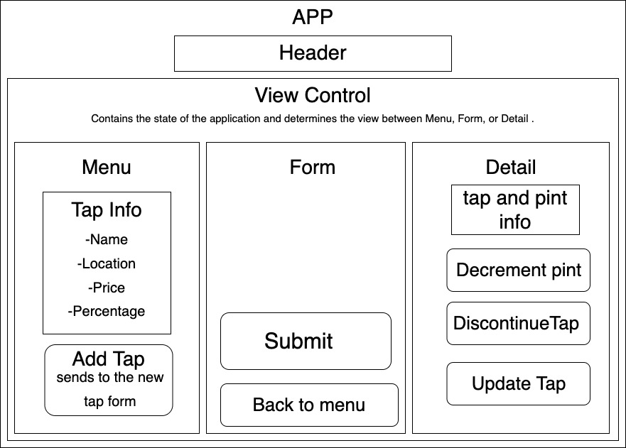

# Tap Room - React Fundamentals Code Review 
* _Date Created: August 21st 2021_
* _Last Updated: August 29th 2021_

#### By _Gabriel Ayala_

***

## Description
Welcome to The Sip Room! A keg management program that allows business owners to list the kegs of all types. A user can list a keg of by inputing its Name, Location, Price, Abv, and Pints. If a person wants to purchase a pint, the keg then lists how many pints are left in the keg.


<details>
    <summary><strong>Expand to Read User Stories</strong></summary>

1. As a user, I want to see a list/menu of all available kegs. For each keg, I want to see its name, brand, price and alcoholContent (or perhaps something like flavor for a kombucha store).
2. As a user, I want to submit a form to add a new keg to a list.
3. As a user, I want to be able to click on a keg to see its detail page.
4. As a user, I want to see how many pints are left in a keg. Hint: A full keg has roughly 124 pints.
5. As a user, I want to be able to click a button next to a keg whenever I sell a pint of it. This should decrease the number of pints left by 1. Pints should not be able to go below 0.

</details>

## Component Diagrm



## Setup/Installation Requirements

<details>
    <summary>Required Programs</summary>
    
1. An internet browser.
2. Visual Code Studio (or another code editor).
3. .NET

</details>

<details>
    <summary>Installation of Program and Startup</summary>

1. Open the terminal on your local machine and navigate to "Desktop."
2. Clone Tap Room with the following git command `git clone https://github.com/GBProductions/tap-room.git`
3. Navigate to the top level of the repository with the command `cd react-tap-room`
4. In the CL, type in `npm install`.
5. In the CL, type in `npm run build`.
6. In the CL, type in `npm start`.

</details>


## Known Bugs

_Update functionality currently deletes all taps._


## Support and contact details

_For assistance, please contact:_ 
* Gabe Ayala <gabeayala100@gmail.com>

## Technologies Used
1. VSCode, Github
2. HTML, CSS, JS, MD, JSX
3. React, Webpack
4. .NET

## Licensing

```

MIT License

Copyright (c) 2021 Gabe Ayala

Permission is hereby granted, free of charge, to any person obtaining a copy
of this software and associated documentation files (the "Software"), to deal
in the Software without restriction, including without limitation the rights
to use, copy, modify, merge, publish, distribute, sublicense, and/or sell
copies of the Software, and to permit persons to whom the Software is
furnished to do so, subject to the following conditions:

The above copyright notice and this permission notice shall be included in all
copies or substantial portions of the Software.

THE SOFTWARE IS PROVIDED "AS IS", WITHOUT WARRANTY OF ANY KIND, EXPRESS OR
IMPLIED, INCLUDING BUT NOT LIMITED TO THE WARRANTIES OF MERCHANTABILITY,
FITNESS FOR A PARTICULAR PURPOSE AND NONINFRINGEMENT. IN NO EVENT SHALL THE
AUTHORS OR COPYRIGHT HOLDERS BE LIABLE FOR ANY CLAIM, DAMAGES OR OTHER
LIABILITY, WHETHER IN AN ACTION OF CONTRACT, TORT OR OTHERWISE, ARISING FROM,
OUT OF OR IN CONNECTION WITH THE SOFTWARE OR THE USE OR OTHER DEALINGS IN THE
SOFTWARE.

```
